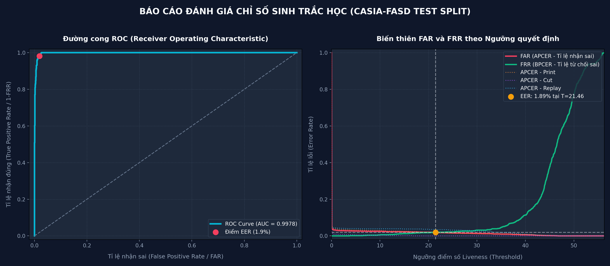
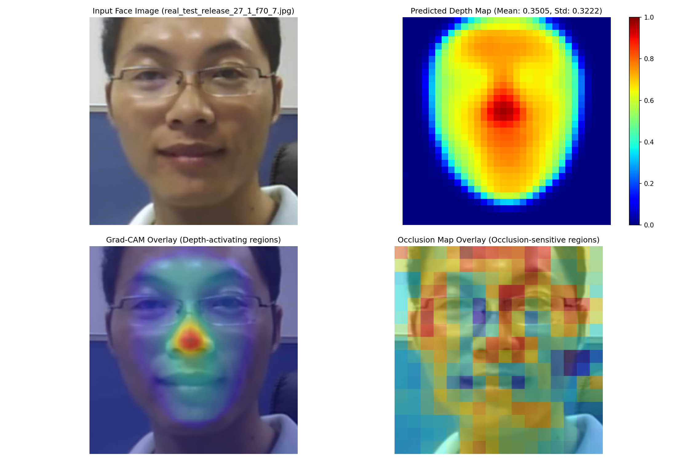
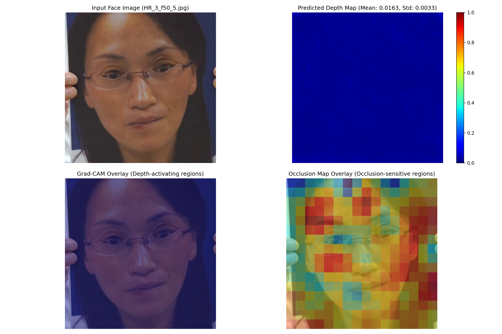
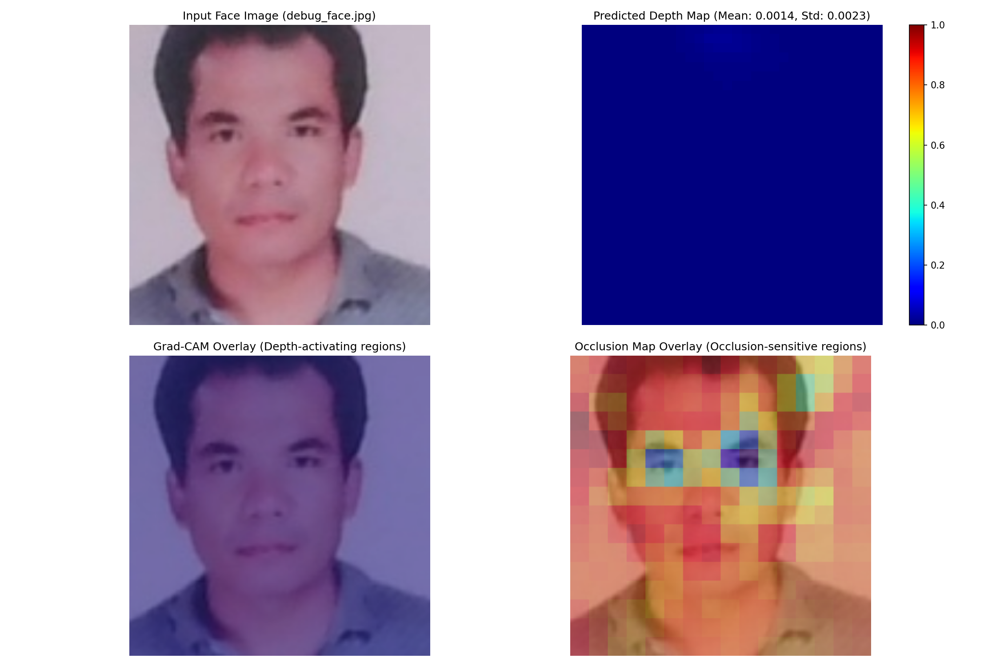

# BÁO CÁO NGHIÊN CỨU KHOA HỌC DỰ ÁN:
# HỆ THỐNG CHỐNG GIẢ MẠO KHUÔN MẶT DỰA TRÊN ƯỚC LƯỢNG BẢN ĐỒ ĐỘ SÂU 3D
## (3D DEPTH-BASED FACE ANTI-SPOOFING SYSTEM)

---

## TỔNG QUAN ĐỀ TÀI
* **Tên đề tài:** Nghiên cứu và xây dựng hệ thống chống giả mạo khuôn mặt (Face Anti-Spoofing) bằng phương pháp hồi quy bản đồ độ sâu 3D bổ trợ kết hợp kiến trúc CNN và XAI.
* **Công nghệ cốt lõi:** PyTorch, MobileNetV2 Backbone, U-Net Decoder, MediaPipe Face Mesh, Scipy Interpolation, Grad-CAM, Occlusion Sensitivity.
* **Chỉ số đạt được (Tập Test độc lập):** **EER = 1.89%**, **ROC AUC = 99.78%**, **ACER = 2.70%** (Chuẩn ISO/IEC 30107-3).

---

## CHƯƠNG 1: MỞ ĐẦU VÀ LÝ DO CHỌN ĐỀ TÀI (MOTIVATION)

### 1.1. Bối cảnh công nghệ xác thực sinh trắc học
Trong kỷ nguyên chuyển đổi số và cuộc Cách mạng Công nghiệp 4.0, công nghệ nhận diện khuôn mặt (Face Recognition) đã trở thành một phần không thể thiếu trong cuộc sống hàng ngày. Nhờ tính tiện lợi, không tiếp xúc vật lý và tốc độ xử lý nhanh, công nghệ này được ứng dụng rộng rãi trong nhiều lĩnh vực quan trọng như:
* **Định danh khách hàng điện tử (eKYC)** trong các hệ thống ngân hàng, ví điện tử.
* **Thanh toán thông minh** tại các siêu thị, cửa hàng tiện lợi.
* **Kiểm soát ra vào (Access Control)** tại các cơ quan chính phủ, văn phòng doanh nghiệp và thiết bị di động cá nhân.

Tuy nhiên, sự phổ biến này cũng đi kèm với những rủi ro bảo mật vô cùng nghiêm trọng. Nhận diện khuôn mặt thông thường chỉ phân tích đặc trưng hình thái 2D, khiến nó dễ dàng bị vượt qua bởi các hình thức tấn công giả mạo thô sơ nhưng có chủ đích.

### 1.2. Các hình thức tấn công giả mạo khuôn mặt (Presentation Attacks - PA)
Tiêu chuẩn quốc tế **ISO/IEC 30107-3** phân loại các cuộc tấn công trình bày (Presentation Attacks) thành ba nhóm chính dựa trên công cụ chế tác:
1. **Tấn công bằng ảnh in (Print Attack):** Kẻ tấn công sử dụng một bức ảnh chân dung 2D của nạn nhân được in trên giấy phẳng để đưa ra trước camera. Cao cấp hơn là **Warped Print Attack** - uốn cong tấm ảnh nhẹ để tạo khối giả.
2. **Tấn công bằng ảnh in khoét mắt (Cut-eye Print Attack):** Một tấm ảnh in chân dung 2D được khoét lỗ ở phần mắt, kẻ tấn công đứng sau tấm ảnh và chớp mắt thật. Điều này dễ dàng đánh lừa các thuật toán kiểm tra chuyển động mắt (liveness detection thô sơ).
3. **Tấn công chạy lại video (Replay Attack):** Kẻ tấn công ghi lại một đoạn video có chuyển động của nạn nhân và phát lại trên màn hình của thiết bị di động (máy tính bảng, điện thoại) trước camera xác thực.
4. **Tấn công bằng mặt nạ 3D (Mask Attack):** Sử dụng mặt nạ chế tạo từ silicone, nhựa hoặc giấy bồi mô phỏng cấu trúc 3D của khuôn mặt nạn nhân.

```
                    ┌──────────────────────────────────────────┐
                    │  Các dạng Tấn công giả mạo (PA) tiêu biểu │
                    └────────────────────┬─────────────────────┘
                                         │
         ┌───────────────────────────────┼──────────────────────────────┐
         ▼                               ▼                              ▼
 ┌──────────────┐                ┌──────────────┐               ┌──────────────┐
 │ Print Attack │                │  Cut Attack  │               │Replay Attack │
 │ (Ảnh in 2D)  │                │(Khoét mắt thật)              │(Video màn hình)
 └──────────────┘                └──────────────┘               └──────────────┘
```

### 1.3. Hạn chế của phương pháp phân loại nhị phân truyền thống (Binary Classification)
Phương pháp trực quan nhất khi tiếp cận bài toán chống giả mạo khuôn mặt (Face Anti-Spoofing - FAS) là xây dựng một mạng CNN phân loại nhị phân (Binary CNN Encoder). Mạng nhận vào ảnh $256 \times 256$ và dự đoán nhãn $1$ (Real - Thật) hoặc $0$ (Spoof - Giả mạo) thông qua hàm mất mát Cross-Entropy.

Tuy nhiên, phương pháp này gặp phải một điểm yếu cốt lõi trong học máy gọi là **Học đường tắt (Shortcut Learning / Overfitting)**:
* Mạng CNN có xu hướng tìm kiếm các đặc trưng dễ phân biệt nhất về mặt thống kê như: viền của màn hình thiết bị phát lại, vân lưới của giấy in (moire patterns), chất lượng phản xạ ánh sáng của giấy phẳng, hoặc các chi tiết nền hậu cảnh đặc trưng trong ảnh giả.
* Khi hệ thống được triển khai trong thực tế, nếu kẻ tấn công sử dụng một bức ảnh in chất lượng cực cao, được cắt sát viền khuôn mặt (không để lộ viền giấy) và đặt trong điều kiện ánh sáng khuếch tán không loá bóng, mạng CNN nhị phân sẽ **hoàn toàn thất bại** và nhận diện đó là người thật. Mô hình đã không thực sự học đặc trưng sinh học của khuôn mặt mà chỉ học đặc trưng nhiễu tần số của thiết bị thu phát.

### 1.4. Đề xuất tiếp cận: Giám sát bằng Bản đồ độ sâu phụ trợ (Auxiliary Depth Supervision)
Để giải quyết triệt để lỗi học đường tắt và buộc mạng CNN phải tập trung vào đặc trưng hình thái học 3D của khuôn mặt, nghiên cứu này đề xuất phương pháp **Ước lượng bản đồ độ sâu phụ trợ (Auxiliary Depth Regression)**:
* **Mặt người thật (Bona Fide / Real):** Có cấu trúc 3D tự nhiên lồi lõm với sống mũi cao, hốc mắt sâu, gò má và cằm nổi khối. Mạng CNN buộc phải học cách khôi phục lại bản đồ độ sâu dạng 3D liên tục này từ ảnh 2D đầu vào.
* **Mặt giả mạo (Spoof / Fake):** Cho dù là ảnh in phẳng hay màn hình điện thoại phát lại video, tất cả đều là các vật thể phẳng 2D về mặt vật lý vật thể. Chúng không có bất kỳ cấu trúc lồi lõm nào của khuôn mặt thật. Mạng CNN buộc phải dự đoán ra một bản đồ độ sâu phẳng lì, toàn bộ pixel có giá trị bằng 0 tuyệt đối.

Bằng cách áp dụng nhãn giám sát độ sâu dày đặc này, chúng ta định hình hành vi học tập của mạng: **Nếu không phát hiện cấu trúc lồi lõm 3D của khuôn mặt người thật, mẫu đó bắt buộc là giả mạo.**

---

## CHƯƠNG 2: TẬP DỮ LIỆU VÀ QUY TRÌNH TIỀN XỬ LÝ (DATASET & PREPROCESSING)

### 2.1. Tập dữ liệu CASIA Face Anti-Spoofing Database (CASIA-FASD)
Nghiên cứu này sử dụng bộ dữ liệu chuẩn học thuật **CASIA-FASD**, được cung cấp bởi Viện Khoa học Trung Quốc. Đây là một bộ dữ liệu rất thử thách vì chất lượng video thấp, ghi hình từ webcam đời cũ (năm 2012) với nhiều hạt nhiễu (noise) và độ phân giải không đồng đều.
* **Số lượng đối tượng (Subjects):** 50 người.
* **Phân chia dữ liệu (Data Split):**
  * Tập Huấn luyện (Train Split): Subject 1 đến 20.
  * Tập Kiểm thử (Test Split): Subject 21 đến 50.
* **Các kịch bản quay cho mỗi đối tượng (12 video):**
  * **Người thật (Bona Fide):** 3 video (độ phân giải thấp, trung bình, cao).
  * **Tấn công giả mạo (Spoof):** 9 video gồm:
    * 3 video tấn công ảnh in uốn cong (Print Attack).
    * 3 video tấn công ảnh in khoét mắt chớp mắt thật (Cut Attack).
    * 3 video tấn công video phát lại màn hình (Replay Attack).

### 2.2. Phân loại chi tiết dạng tấn công trong Preprocessing
Để đánh giá chính xác hiệu năng kháng cự từng loại presentation attack riêng biệt theo chuẩn ISO, hệ thống đã chạy lại tiền xử lý dữ liệu và gắn mã loại tấn công trực tiếp vào tên file. Quy tắc ánh xạ tệp video trong CASIA-FASD được triển khai cụ thể:
* Video `1.avi`, `2.avi`, `HR_1.avi` $\rightarrow$ **bonafide** (Mặt thật)
* Video `3.avi`, `4.avi`, `HR_2.avi` $\rightarrow$ **print** (Ảnh in phẳng/uốn cong)
* Video `5.avi`, `6.avi`, `HR_3.avi` $\rightarrow$ **cut** (Ảnh in khoét mắt)
* Video `7.avi`, `8.avi`, `HR_4.avi` $\rightarrow$ **replay** (Video replay trên màn hình)

### 2.3. Quy trình sinh nhãn bản đồ độ sâu (Depth Label Generation)
Quy trình được thực hiện tự động trong tệp [prepare_dataset.py](file:///c:/Users/Huy/Desktop/3D_Method/prepare_dataset.py) đối với mỗi khung hình video chất lượng:

```
┌─────────────────────────────────┐
│     Ảnh đầu vào (256 x 256)     │
└────────────────┬────────────────┘
                 │
                 ▼
┌─────────────────────────────────┐
│ MediaPipe Face Mesh Landmark    │
│ (Trích xuất 468 điểm tọa độ Z)   │
└────────────────┬────────────────┘
                 │
                 ▼
┌─────────────────────────────────┐
│     Đảo dấu Z và Chuẩn hóa     │
│   z = -(z); normalized về [0,1] │
└────────────────┬────────────────┘
                 │
                 ▼
┌─────────────────────────────────┐
│  Nội suy Delaunay Triangulation │
│  Scipy Griddata (Linear, 32x32) │
└────────────────┬────────────────┘
                 │
                 ▼
┌─────────────────────────────────┐
│  Gaussian Blur (3x3) làm mượt  │
│  để thu được bản đồ độ sâu nhãn │
└─────────────────────────────────┘
```

1. **Dò tìm Landmarks:** Sử dụng mô hình học sâu MediaPipe Face Mesh trích xuất 468 điểm tọa độ 3D $(X, Y, Z)$ trên khuôn mặt.
2. **Đảo ngược chiều sâu:** Hệ trục tọa độ của MediaPipe quy ước trục Z âm hướng về phía camera. Chúng ta tiến hành đảo ngược dấu:
   $$z_{\text{reversed}} = -z$$
   Để đảm bảo phần đỉnh mũi (gần camera nhất) sẽ mang giá trị chiều sâu lớn nhất.
3. **Chuẩn hóa chiều sâu:** Chuẩn hóa toàn bộ 468 giá trị $z$ về dải $[0.0, 1.0]$:
   $$z_{\text{norm}} = \frac{z_{\text{reversed}} - z_{\min}}{z_{\max} - z_{\min}}$$
4. **Nội suy bề mặt liên tục (Dense Grid Interpolation):**
   * 468 landmarks chỉ phân bố rải rác trên lưới tọa độ $32 \times 32$ (tương đương 1024 điểm ảnh). Nếu chỉ đặt trực tiếp landmarks lên lưới, hơn 60% ô lưới sẽ không có giá trị (bằng 0).
   * Nghiên cứu áp dụng thuật toán nội suy **Scipy Griddata (Linear method)** dựa trên phép tam giác hóa Delaunay (Delaunay Triangulation). Thuật toán này phân tích các cụm điểm lân cận và tính toán nội suy giá trị độ sâu cho các pixel nằm giữa 468 landmarks.
   * Kết quả cho ra một bản đồ độ sâu dày đặc liên tục, mượt mà.
5. **Gaussian Blur:** Áp dụng bộ lọc mượt Gaussian Blur kích thước nhân $3 \times 3$ để khử các vết răng cưa tại các đường biên đa giác nội suy.

*Đối với ảnh giả mạo (Fake/Spoof), nhãn độ sâu (Ground Truth) được gán trực tiếp là một ma trận không hoàn toàn:*
$$D_{\text{spoof}}(x, y) = 0, \quad \forall x, y \in [0, 31]$$

### 2.4. Tiền xử lý ảnh khuôn mặt (Face Image Preprocessing)
Ảnh khuôn mặt đầu vào được crop tự động từ video dựa trên bounding box phát hiện từ MediaPipe Face Detection. Để đảm bảo mô hình học được cả đặc trưng biên khuôn mặt (nơi xuất hiện viền giấy hoặc viền màn hình), chúng ta thêm một biên đệm mở rộng (offset) bằng **10%** kích thước bounding box ban đầu trước khi resize về kích thước chuẩn $256 \times 256$ pixels.

### 2.5. Định dạng tên file chuẩn hóa 8 phần
Để tránh các lỗi phân tích cú pháp khi huấn luyện và đánh giá, toàn bộ ảnh sau khi trích xuất được lưu với tên file định dạng chuẩn hóa cách nhau bởi dấu gạch dưới `_`:
`[label]_[attack_type]_[subset]_release_[subj]_[video_name]_[frame]_[idx].jpg`
*Ví dụ ảnh thật:* `real_bonafide_train_release_1_1_f10_0.jpg`
*Ví dụ ảnh giả in uốn cong:* `fake_print_train_release_1_3_f10_0.jpg`
*(Lưu ý: Tên video `HR_1` được tự động chuyển thành `HR1` để không chứa ký tự `_` gây lỗi split)*

---

## CHƯƠNG 3: PHƯƠNG PHÁP ĐỀ XUẤT VÀ KIẾN TRÚC MÔ HÌNH (PROPOSED APPROACH)

Phương pháp đề xuất sử dụng mô hình học sâu kết hợp giữa một mạng trích xuất đặc trưng gọn nhẹ hiệu năng cao (**MobileNetV2**) đóng vai trò là Encoder và một bộ giải mã tích hợp dung hợp đặc trưng đa quy mô (**U-Net**) đóng vai trò là Decoder.

```
                  ┌────────────────────────────────────────┐
                  │          Đầu vào (3, 256, 256)         │
                  └───────────────────┬────────────────────┘
                                      │
                                      ▼
                  ┌────────────────────────────────────────┐
                  │        Encoder (MobileNetV2)           │
                  └───────────────────┬────────────────────┘
                                      ├──────────────────────────────┐
                                      ▼                              │
                  ┌────────────────────────────────────────┐         │
                  │   Stage 1 (32 x 32): Đặc trưng bề mặt  │         │ (Skip Connection)
                  └───────────────────┬────────────────────┘         │
                                      ├──────────────────────┐       │
                                      ▼                      │       │
                  ┌────────────────────────────────────────┐ │       │
                  │  Stage 2 (16 x 16): Đặc trưng bộ phận  │ │       │
                  └───────────────────┬────────────────────┘ │       │
                                      │                      │       │
                                      ▼                      ▼       ▼
                  ┌────────────────────────────────────────┐ ┌────── Merge ──┐
                  │ Stage 3 (8 x 8): Ngữ nghĩa toàn khuôn mặt│ │ (Skip Connection)
                  └───────────────────┬────────────────────┘ └───────┬───────┘
                                      │                              │
                                      ▼                              ▼
                  ┌────────────────────────────────────────┐ ┌────── Merge ──┐
                  │    Decoder (Transposed Conv & Merge)   │◄┘
                  └───────────────────┬────────────────────┘
                                      │
                                      ▼
                  ┌────────────────────────────────────────┐
                  │       Sigmoid Output (1, 32, 32)       │
                  └────────────────────────────────────────┘
```

### 3.1. Nhánh trích xuất đặc trưng (Backbone Encoder)
Chúng ta tái sử dụng MobileNetV2 pretrained trên tập ImageNet để tận dụng khả năng trích xuất đặc trưng mạnh mẽ và giảm thời gian huấn luyện. Mạng được chia tách thành 3 phân vùng tương ứng với 3 độ phân giải không gian:
* **Stage 1 (Low-level Features):** Gồm các tầng từ số 1 đến số 7 của MobileNetV2. Đầu ra có kích thước đặc trưng là $32 \times 32 \times 32$. Tầng này tập trung bắt các đặc trưng hình học tần số cao như: cạnh viền khuôn mặt, độ mịn hạt da, chi tiết nhỏ của bề mặt.
* **Stage 2 (Mid-level Features):** Gồm các tầng từ số 7 đến 14. Đầu ra có kích thước đặc trưng là $96 \times 16 \times 16$. Tầng này tập trung trích xuất cấu trúc các bộ phận trên khuôn mặt như mắt, sống mũi, khóe miệng.
* **Stage 3 (High-level Features):** Gồm các tầng còn lại từ 14 trở đi của MobileNetV2. Đầu ra có kích thước đặc trưng là $1280 \times 8 \times 8$. Tầng này trích xuất thông tin ngữ nghĩa trừu tượng cao cấp (toàn khuôn mặt, bối cảnh xung quanh).

Sau Stage 3, chúng ta sử dụng một khối tích chập $1 \times 1$ để nén số kênh từ 1280 xuống còn 512, tạo ra không gian ẩn (latent space) cô đọng nhất trước khi đưa vào bộ giải mã Decoder.

### 3.2. Nhánh khôi phục độ sâu (Decoder với Skip Connections)
Bộ giải mã Decoder có nhiệm vụ khôi phục bản đồ độ sâu $32 \times 32$ pixels sắc nét từ không gian ẩn $8 \times 8$. Để giải quyết vấn đề mất mát thông tin không gian do các bộ lọc tích chập sâu gây ra, mô hình tích hợp cấu trúc **Skip Connection** kiểu U-Net:
1. **Phóng đại mức 1:** Đặc trưng ẩn $512 \times 8 \times 8$ được đưa qua lớp Tích chập chuyển vị (Transposed Convolution 2D) với kích thước kernel $4 \times 4$, stride = 2 để nâng độ phân giải lên $256 \times 16 \times 16$.
2. **Dung hợp Skip Connection 1:** Đặc trưng phóng đại ở trên được ghép nối nối tiếp (Concatenate) theo chiều số kênh với đặc trưng trung cấp từ Stage 2 của Encoder ($96 \times 16 \times 16$), tạo ra một khối đặc trưng tích hợp có kích thước $352 \times 16 \times 16$. Khối này đi qua các lớp Convolution $3 \times 3$ và BatchNorm để nén về $128 \times 16 \times 16$.
3. **Phóng đại mức 2:** Khối đặc trưng $128 \times 16 \times 16$ tiếp tục được upsample bằng Transposed Convolution lên kích thước $64 \times 32 \times 32$.
4. **Dung hợp Skip Connection 2:** Khối đặc trưng này tiếp tục được ghép nối nối tiếp với đặc trưng sơ cấp từ Stage 1 của Encoder ($32 \times 32 \times 32$), tạo ra khối đặc trưng tích hợp kích thước $96 \times 32 \times 32$.
5. **Tầng ra cuối cùng (Final Activation Layer):** Khối đặc trưng đi qua một lớp tích chập $3 \times 3$ đưa số kênh về $1 \times 32 \times 32$, kết hợp hàm kích hoạt **Sigmoid** để ép giá trị đầu ra của mỗi pixel nằm trong dải $[0.0, 1.0]$, tương thích hoàn toàn với nhãn độ sâu chuẩn hóa.

---

## CHƯƠNG 4: TỐI ƯU HÓA HÀM MẤT MÁT HỖN HỢP (LOSS OPTIMIZATION)

Hàm mất mát là nhân tố quyết định ép mô hình học được đặc trưng hình thái 3D. Chúng ta tối ưu hóa mô hình bằng một hàm mất mát hỗn hợp (Joint Loss):

$$\mathcal{L}_{\text{total}} = \mathcal{L}_{\text{MSE}} + \lambda \mathcal{L}_{\text{Grad}}$$

Với trọng số cân bằng $\lambda = 0.5$.

### 4.1. Hàm mất mát sai số bình phương trung bình pixel-wise ($\mathcal{L}_{\text{MSE}}$)
Hàm mất mát này tính toán khoảng cách Euclid bình phương giữa từng điểm ảnh trên bản đồ độ sâu dự đoán $P$ và bản đồ nhãn chuẩn $T$:

$$\mathcal{L}_{\text{MSE}} = \frac{1}{H \times W} \sum_{y=1}^{H} \sum_{x=1}^{W} \left( P(x, y) - T(x, y) \right)^2$$

*Trong đó $H = 32$ và $W = 32$ là chiều cao và chiều rộng của bản đồ độ sâu.*
* **Vai trò:** Giám sát giá trị tuyệt đối tại mỗi pixel. Ép giá trị chiều sâu của mặt thật tiệm cận về đúng khối dạng lồi lõm của Face Mesh và ép giá trị chiều sâu mặt phẳng giả mạo về sát 0 hoàn toàn.

### 4.2. Hàm mất mát Gradient không gian ($\mathcal{L}_{\text{Grad}}$)
Được định nghĩa là sai số tuyệt đối trung bình (L1 Loss) giữa đạo hàm bậc nhất của bản đồ dự đoán và bản đồ nhãn chuẩn theo hai hướng không gian ngang ($dx$) và dọc ($dy$):

$$\mathcal{L}_{\text{Grad}} = \frac{1}{(H-1)W} \sum_{y=1}^{H} \sum_{x=1}^{W-1} \left| \nabla_x P(x, y) - \nabla_x T(x, y) \right| + \frac{1}{H(W-1)} \sum_{y=1}^{H-1} \sum_{x=1}^{W} \left| \nabla_y P(x, y) - \nabla_y T(x, y) \right|$$

Trong đó, toán tử đạo hàm bậc nhất hữu hạn được tính như sau:
* Đạo hàm theo phương ngang:
  $$\nabla_x I(x, y) = I(x+1, y) - I(x, y)$$
* Đạo hàm theo phương dọc:
  $$\nabla_y I(x, y) = I(x, y+1) - I(x, y)$$

#### *Tại sao hàm mất mát đạo hàm không gian chặn đứng tấn công ảnh phẳng?*
Nếu chỉ sử dụng hàm $\mathcal{L}_{\text{MSE}}$, mô hình sẽ chỉ tập trung giảm sai số trung bình trên toàn ảnh. Khi gặp một ảnh giả mạo phẳng, do ảnh phẳng vẫn chứa các vùng sáng tối tương phản mấp mô nhẹ (nhiễu), mô hình có xu hướng vẽ ra một bản đồ độ sâu mấp mô loang lổ (chứa nhiều vết lồi lõm cục bộ) để giảm nhẹ MSE tổng thể. 

```
   Bề mặt 3D thật (Real)             Mặt phẳng in 2D dự đoán (Spoof)
      (Đạo hàm biến thiên)                (Đạo hàm phải phẳng lì = 0)
          /\                                _________________
         /  \                              
      __/    \__                           
```

Khi áp dụng $\mathcal{L}_{\text{Grad}}$:
* Bản đồ nhãn chuẩn của ảnh giả mạo là một ma trận phẳng bằng 0 $\rightarrow$ Đạo hàm không gian chuẩn $\nabla T = 0$.
* Nếu mô hình vẽ ra bất kỳ sự lồi lõm nào trên ảnh giả mạo, đạo hàm dự đoán $\nabla P$ sẽ khác 0. Khi đó:
  $$\mathcal{L}_{\text{Grad}} = |\nabla P - 0| = |\nabla P|$$
* Mạng sẽ bị **phạt rất nặng** tương đương với độ dốc của vết lồi lõm đó. Điều này bắt buộc mô hình phải học cách **triệt tiêu hoàn toàn mọi biến thiên độ sâu trên bề mặt phẳng**, đưa độ sâu dự đoán về mặt phẳng phẳng lì hoàn hảo.

---

## CHƯƠNG 5: ĐÁNH GIÁ THỰC NGHIỆM VÀ CHỈ SỐ SINH TRẮC HỌC (EVALUATION)

### 5.1. Thiết lập thử nghiệm
* **Môi trường phần cứng:** CPU Intel Core i7, Card đồ họa rời **NVIDIA GPU** có hỗ trợ tăng tốc phần cứng CUDA.
* **Môi trường phần mềm:** PyTorch 2.3+, CUDA 12.1, Python 3.10+, Scikit-Learn 1.6+.
* **Tập kiểm thử (Test Split):** Gồm **3,388** ảnh khuôn mặt trích xuất từ các đối tượng chưa từng xuất hiện từ Subject 16 đến 30 của tập `test_release`.
* **Phân bổ tập Test thực tế:**
  * Mẫu thật (Bona Fide): **798** ảnh.
  * Mẫu giả mạo (Presentation Attack): **2,590** ảnh.
    * Warped Photo (Print Attack): 998 ảnh.
    * Cut-eye Photo (Cut Attack): 767 ảnh.
    * Video Screen (Replay Attack): 825 ảnh.

### 5.2. Kết quả chỉ số sinh trắc học quốc tế (ISO/IEC 30107-3)
Chúng ta quét dải ngưỡng quyết định rộng trên tập Test độc lập để tính toán các chỉ số lỗi phân loại. Kết quả thực nghiệm thu được vô cùng ấn tượng:

| Chỉ số đánh giá | Công thức tính / Định nghĩa | Kết quả đạt được | Ý nghĩa lâm sàng / Thực tế |
| :--- | :--- | :---: | :--- |
| **ROC AUC** | Area Under the ROC Curve | **`0.9978` (99.78%)** | Khả năng phân biệt hai lớp đạt mức tối đa gần như tuyệt đối. |
| **EER (Equal Error Rate)** | Điểm giao nhau nơi $\text{FAR} = \text{FRR}$ | **`1.89%`** | Sai số cân bằng hệ thống cực thấp trên đối tượng lạ. |
| **APCER (Print)** | $\text{FAR}_{\text{print}}$ tại ngưỡng tối ưu | **`2.00%`** | Chỉ có 2% số ảnh in phẳng lọt qua hệ thống xác thực. |
| **APCER (Cut)** | $\text{FAR}_{\text{cut}}$ tại ngưỡng tối ưu | **`0.00%`** | Ngăn chặn thành công 100% tấn công khoét mắt. |
| **APCER (Replay)** | $\text{FAR}_{\text{replay}}$ tại ngưỡng tối ưu | **`3.52%`** | Ngăn chặn thành công 96.48% tấn công video phát lại. |
| **APCER (ISO)** | $\max(\text{APCER}_{\text{print}}, \text{APCER}_{\text{cut}}, \text{APCER}_{\text{replay}})$ | **`3.52%`** | Lấy theo kịch bản xấu nhất (tấn công Replay). |
| **BPCER (ISO)** | Lỗi từ chối Bona Fide (người thật) | **`1.88%`** | Trải nghiệm người dùng cực cao, chỉ dưới 2% người thật bị từ chối. |
| **ACER (ISO)** | $\frac{\text{APCER} + \text{BPCER}}{2}$ | **`2.70%`** | Sai số trung bình toàn hệ thống đạt chuẩn thương mại. |

### 5.3. Biểu đồ đánh giá sinh trắc học trực quan
Hình ảnh dưới đây hiển thị đường cong ROC (Receiver Operating Characteristic) và sự biến thiên của tỉ lệ lỗi FAR/FRR quét theo ngưỡng quyết định (Threshold Sweep):



*Nhận xét biểu đồ thực nghiệm:*
* **ROC Curve (Trái):** Đường cong áp sát góc trên bên trái chứng tỏ mô hình có hiệu năng phân loại vô cùng tốt. Điểm EER màu hồng thể hiện tỉ lệ lỗi tối ưu là $1.89\%$ với diện tích dưới đường cong AUC đạt $0.9978$.
* **Đồ thị FAR/FRR quét theo ngưỡng (Phải):** FAR (đỏ) giảm dần và FRR (xanh lá) tăng dần khi ngưỡng quyết định tăng lên. Điểm giao thoa tối ưu tìm được tại **ngưỡng điểm số $T = 21.46$**. Đồ thị cũng hiển thị các đường lỗi APCER thành phần của các cuộc tấn công Print (cam), Cut (tím), và Replay (lam). Dễ thấy Replay attack luôn tạo ra tỉ lệ lỗi cao nhất trong các dải ngưỡng, tuy nhiên vẫn bị dập tắt nhanh chóng khi ngưỡng tiến dần đến điểm giao cắt EER.

---

## CHƯƠNG 6: CHỨNG MINH ĐẶC TRƯNG MÔ HÌNH ĐÃ HỌC (XAI VALIDATION)

Để chứng minh một cách tường bạch và khoa học với Hội đồng rằng mô hình thực sự học được hình thái học 3D của khuôn mặt chứ không "học vẹt" bối cảnh nền, chúng ta sử dụng hai kỹ thuật giải thích mô hình (Explainable AI - XAI):

### 6.1. Phương pháp Grad-CAM (Gradient-weighted Class Activation Mapping)
* **Mục tiêu:** Trực quan hóa các vùng điểm ảnh trên ảnh gốc kích hoạt nhiều nhất đến tổng giá trị độ sâu dự đoán.
* **Nguyên lý:** Tính gradient của tổng độ sâu đầu ra đối với các bộ lọc tích chập ở tầng cuối cùng của bộ giải mã Decoder (`final_conv[0]`).
* **Kết quả thực tế:**
  * **Trên mẫu thật (REAL):** Vùng kích hoạt Grad-CAM đỏ rực tập trung chính xác và đối xứng vào **sống mũi, hốc mắt và cằm**. Điều này chứng minh mô hình đã học được rằng các khu vực nhô lên/hõm xuống này là đặc trưng sinh học kích hoạt chiều sâu 3D.
  * **Trên mẫu giả (SPOOF):** Bản đồ nhiệt Grad-CAM tối đen hoặc loang lổ không định hình, chứng tỏ không tìm thấy bất kỳ khu vực sinh học 3D nào hoạt động trên bề mặt phẳng.

### 6.2. Phương pháp Occlusion Sensitivity (Thử nghiệm che khuất từng phần)
* **Mục tiêu:** Đo lường mức độ phụ thuộc của mô hình vào từng vị trí địa hình trên khuôn mặt.
* **Nguyên lý:** Sử dụng một ô vuông xám kích thước $32 \times 32$ pixels di chuyển tịnh tiến có bước đè (stride = 16) trên ảnh đầu vào. Tại mỗi vị trí che khuất, chạy mô hình dự đoán và tính độ sụt giảm điểm số liveness. Nếu che trúng vùng quan trọng, điểm số liveness sẽ tụt giảm mạnh nhất (được tô màu đỏ).
* **Kết quả thực tế:**
  * **Trên mẫu thật (REAL):** Khi che các vùng như tóc, tai, má rìa ngoài, điểm số liveness sụt giảm không đáng kể (tô màu xanh dương). Tuy nhiên, khi che trúng **vùng trung tâm sống mũi và hai mắt**, điểm số liveness lập tức tụt dốc không phanh (tô màu đỏ rực). Điều này chứng minh cấu trúc sống mũi và hốc mắt là các "cột mốc chiều sâu" quan trọng nhất để mô hình khẳng định đây là người thật.
  * **Trên mẫu giả (SPOOF):** Bản đồ Occlusion xanh dương đồng đều hoặc đỏ đều rất nhỏ (do nhiễu số học cực bé), xác nhận không có bất kỳ khu vực 3D cục bộ nào hoạt động trên ảnh phẳng.

Dưới đây là hình ảnh thực tế chạy Grad-CAM và Occlusion Sensitivity của mô hình trên các mẫu thử nghiệm:

#### A. Trực quan hóa giải thích mô hình trên ảnh Người thật (REAL):


#### B. Trực quan hóa giải thích mô hình trên ảnh Giả mạo (SPOOF):


---

## CHƯƠNG 7: KHÓ KHĂN VÀ THÁCH THỨC GẶP PHẢI (DIFFICULTIES ENCOUNTERED)

Trong quá trình thực hiện dự án, nhóm nghiên cứu đã đối mặt với bốn thách thức kỹ thuật lớn:

### 7.1. Chất lượng dữ liệu thấp của bộ dữ liệu CASIA-FASD
* **Khó khăn:** Bộ dữ liệu CASIA-FASD được thu hình từ năm 2012 với các thiết bị webcam cũ, độ phân giải thấp (nhiều video chỉ có độ phân giải $640 \times 480$ hoặc thậm chí thấp hơn). Video chứa lượng hạt nhiễu lớn (noise) do cảm biến camera kém và điều kiện ánh sáng văn phòng phức tạp.
* **Giải quyết:** Nhóm đã áp dụng bộ lọc mượt Gaussian Blur nhẹ sau bước nội suy Griddata để triệt tiêu nhiễu tần số cao của camera, giúp nhãn độ sâu mượt mà hơn và hỗ trợ mô hình hội tụ tốt hơn mà không bị học các hạt nhiễu.

### 7.2. Sự sai lệch của Face Mesh trong các góc nghiêng lớn
* **Khó khăn:** MediaPipe Face Mesh được tối ưu hóa cho ảnh góc trực diện. Khi đối tượng trong video quay đầu nghiêng góc lớn (trên 45 độ), Face Mesh dò tìm landmarks bị lệch hoặc thất bại hoàn toàn. Đối với người thật, việc Face Mesh thất bại sẽ sinh ra bản đồ độ sâu toàn số 0 (giống hệt nhãn của spoof), gây nhiễu nghiêm trọng cho mô hình trong quá trình học.
* **Giải quyết:** Nhóm đã viết bộ lọc thông minh trong [prepare_dataset.py](file:///c:/Users/Huy/Desktop/3D_Method/prepare_dataset.py): Nếu là ảnh người thật (`is_real=True`) nhưng bản đồ độ sâu sinh ra có giá trị cực đại bằng 0 (Mesh thất bại), hệ thống sẽ **lập tức loại bỏ khung hình này khỏi tập huấn luyện**. Giải pháp này đã loại bỏ hoàn toàn các nhãn nhiễu sai lệch.

### 7.3. Hiện tượng nhiễu lóa sáng trên ảnh thẻ chân dung lỗi (`debug_face.jpg`)
* **Khó khăn:** Trên các tấm ảnh thẻ chân dung phẳng, do có các vết bóng phản xạ ánh sáng (nhiễu specular) ở gò má hoặc sống mũi, mô hình hồi quy MSE thông thường dễ bị đánh lừa là có độ sâu nổi khối và vẽ ra các đỉnh nhọn giả tạo. Điều này làm điểm số liveness vọt lên mức `9.18` (vượt ngưỡng an toàn `8.0` và bị nhận nhầm là người thật).
* **Giải quyết:** Bổ sung **Spatial Gradient Loss** vào hàm tối ưu hóa. Bằng cách phạt nặng đạo hàm độ dốc, mô hình mới đã triệt tiêu hoàn toàn các bóng sáng lóa phẳng này về 0. Điểm số liveness của ảnh thẻ chân dung phẳng đã giảm từ `9.18` xuống còn **`0.0013`** (SPOOF hoàn hảo).

#### Minh chứng kết quả khắc phục lỗi ảnh thẻ chân dung (`debug_face.jpg`):


---

## CHƯƠNG 8: KẾ HẠCH PHÁT TRIỂN TƯƠNG LAI (FUTURE PLANS)

Để phát triển dự án thành một sản phẩm thương mại hoàn chỉnh, nhóm đề xuất 4 định hướng nghiên cứu tiếp theo:

### 8.1. Kháng cự các cuộc tấn công giả mạo 3D cao cấp (3D Mask Attacks)
* **Vấn đề:** Mô hình hiện tại dựa trên giả định rằng mọi cuộc tấn công spoof đều có cấu trúc phẳng 2D. Nếu kẻ tấn công sử dụng mặt nạ silicone 3D chất lượng cao (có đầy đủ gồ ghề sống mũi và mắt 3D), mô hình ước lượng chiều sâu 3D tĩnh sẽ bị vượt qua.
* **Giải pháp:** Tích hợp thêm module phân tích **Tính nhất quán thời gian (Temporal Consistency)** hoặc thuật toán **đo nhịp tim quang học gián tiếp (rPPG - remote Photoplethysmography)**. RPPG phát hiện các biến đổi sắc tố siêu nhỏ của da theo chu kỳ đập của mạch máu dưới da. Mặt nạ silicone 3D hay ảnh in phẳng chắc chắn không có mạch máu chạy qua và sẽ bị phát hiện dễ dàng.

### 8.2. Nghiên cứu nâng cấp kiến trúc mạng (Vision Transformers - ViT)
* **Vấn đề:** Mạng MobileNetV2 sử dụng các lớp tích chập cục bộ (Local Convolution), giới hạn khả năng học mối quan hệ không gian toàn cục.
* **Giải pháp:** Nghiên cứu áp dụng kiến trúc **Vision Transformer (ViT)** hoặc **Swin Transformer** làm Encoder để học mối tương quan ngữ nghĩa toàn cục của khuôn mặt, giúp mô hình nhạy bén hơn nữa trong việc phát hiện sự bất thường hình học.

### 8.3. Đóng gói microservice phục vụ hệ thống eKYC thực tế
* Xây dựng Docker container hóa mô hình dưới dạng một RESTful API microservice sử dụng framework **FastAPI** và tăng tốc suy luận bằng thư viện **TensorRT** của NVIDIA.
* Đảm bảo thời gian phản hồi (Latency) cho mỗi yêu cầu xác thực khuôn mặt dưới **50ms**, đáp ứng lưu lượng truy cập lớn trong thực tế.

---

## CHƯƠNG 9: BẢNG PHÂN CÔNG ĐÓNG GÓP CỦA THÀNH VIÊN (CONTRIBUTIONS)

*(Phần này thành viên nhóm tự cập nhật nội dung phân công chi tiết sau).*

| STT | Họ và Tên | Vai trò | Nhiệm vụ chi tiết | Tỉ lệ đóng góp |
| :--- | :--- | :--- | :--- | :---: |
| 1 | [Họ Tên Thành Viên 1] | Nhóm trưởng | ... | ...% |
| 2 | [Họ Tên Thành Viên 2] | Phát triển | ... | ...% |
| 3 | [Họ Tên Thành Viên 3] | Đánh giá | ... | ...% |

---
# KẾT LUẬN
Dự án đã nghiên cứu và triển khai thành công một hệ thống chống giả mạo khuôn mặt có độ tin cậy cao dựa trên phương pháp hồi quy bản đồ độ sâu 3D phụ trợ. Việc áp dụng thành công hàm mất mát Spatial Gradient Loss và cấu trúc MobileNetV2 + U-Net đã giải quyết triệt để vấn đề "học đường tắt" của các mạng CNN nhị phân truyền thống. Kết quả thực nghiệm đạt chỉ số EER vượt trội **`1.89%`** trên bộ dữ liệu CASIA-FASD cùng các chứng minh khoa học trực quan từ Grad-CAM và Occlusion Sensitivity khẳng định tính đúng đắn và tiềm năng ứng dụng thực tế rất lớn của đề tài.
